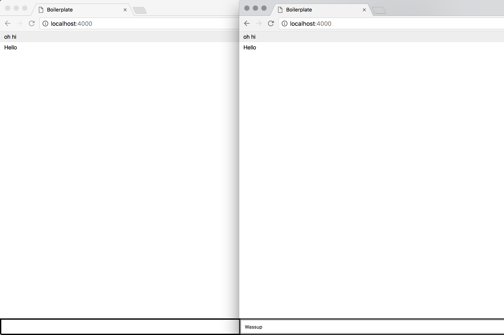

# A Chat app
This is a chat app where you can receive realtime messages. These messages can also be pinned to view it at a later time.




## Getting started

installl dependencies

```npm install```

Start application. Start port is 4000
```npm start``` 


## What's Used

* `ejs: 2.5.8,`
* `express: 4.16.3,`
* `nodemon: 1.17.3,`
* `save: 2.3.2`
* `socket.io: 2.1.0`
