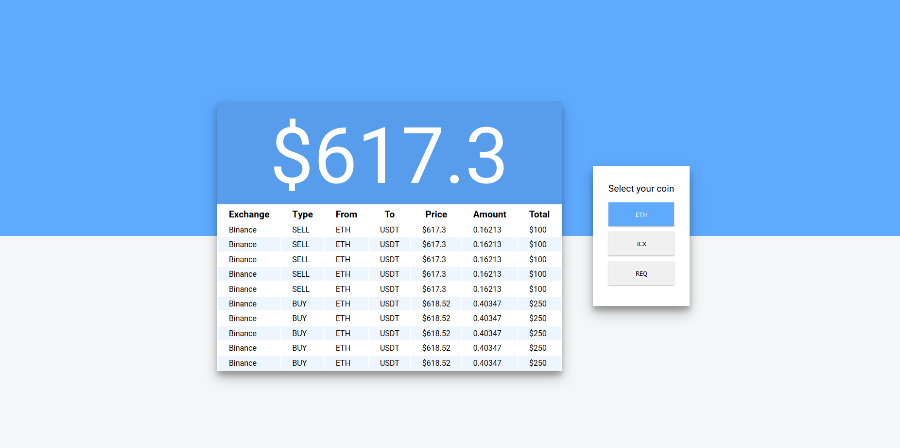
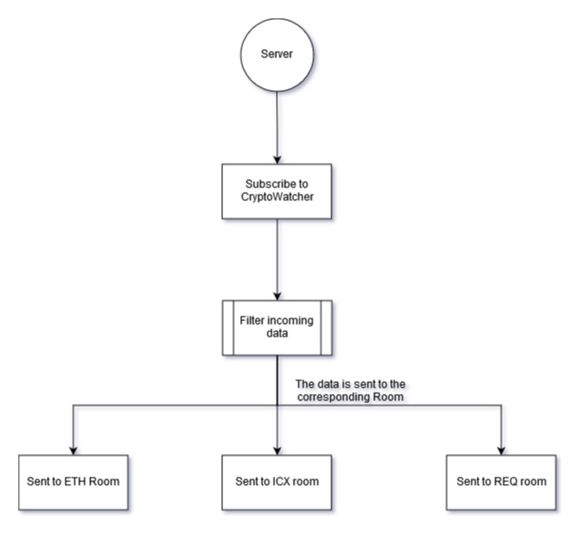
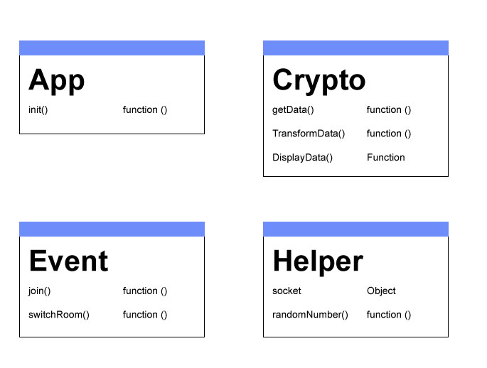
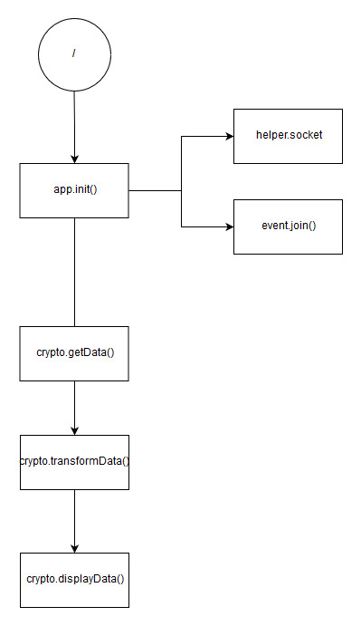

# Crypto Monitor
The Crypto Monitor is an application where the user is able to track realtime trading that takes place on Binance Exchange.

Link to demo: https://gentle-temple-43808.herokuapp.com/



## Getting started

Get all dependencies 
```
npm install
```

Start application
```
npm start
```

Standard port is 4000
```
localhost:4000
```

## API
This application use the API from [CryptoCompare](https://www.cryptocompare.com/api/#-api-web-socket-). 

Get realtime data from CryptoCompare by connecting to:
```
wss://streamer.cryptocompare.com
```

### Subscribe
Subscribe to market data by emitting 'SubAdd' including a list of items you want to get updates on.

Subscription items have the format of '{SubscriptionId}~{ExchangeName}~{FromSymbol}~{ToSymbol}'

Example:
```
socket.emit('SubAdd', { subs: ['0~Poloniex~BTC~USD'] } ); 
```

You can subscribe to the following:

|SubscriptionId |	Name 	| Description
|---|---|---|
|0 	| TRADE 	|Trade level data on a currency pair from a specific exchange.
|2 	| CURRENT |	Latest quote update of a currency pair from a specific exchange.
|5 	| CURRENTAGG 	| Quote update aggregated over the last 24 hours of a currency pair | from a specific exchange.


### Unsubscribe

Unsubscribe by sending 'SubRemove' message with a list of items.

## Flow diagram

### Server 


### Client

#### Actor diagram


#### Flow


## Todo
- [x] Connect to CryptoCompare
- [x] Subscribe to Current trade
- [x] Track transaction
- [ ] Save user to database
- [ ] Tunnel effect status

## Wishlist 
- [ ] Sent status of server to client
- [ ] Sent status of Client to server 

## Features

* `ejs: 2.5.8,`
* `express: 4.16.3,`
* `nodemon: 1.17.3,`
* `socket.io: 2.1.0`
